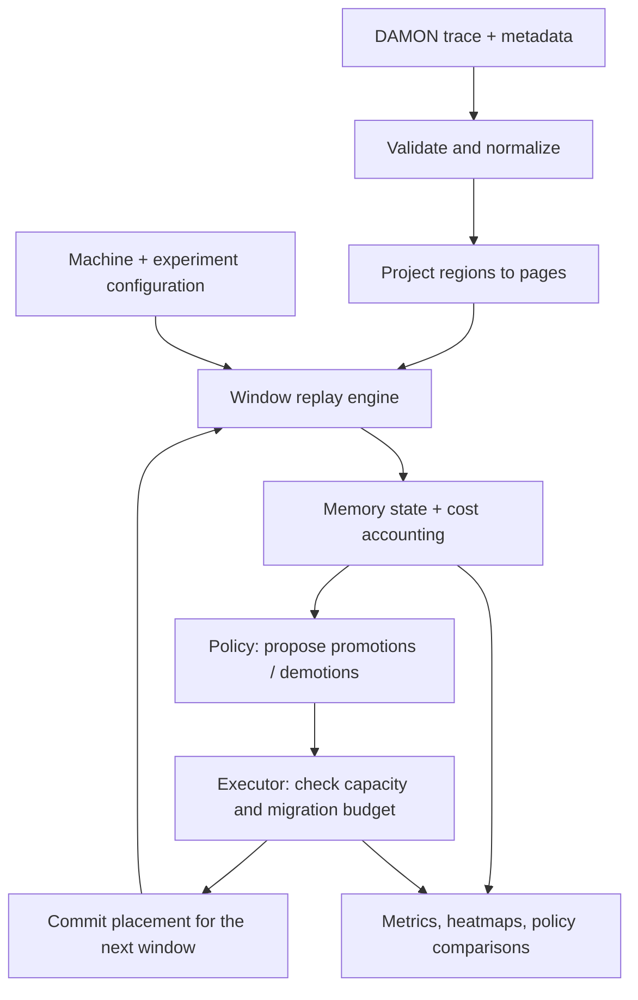

# Tiered Memory Simulator: Design Update


## 1. What type of trace do we expect?

**A sequence of memory-activity snapshots from DAMON: a heatmap over time, with address ranges as rows and observation windows as columns.** Initial workloads are PageRank, BFS, and Redis.

Preserve the raw recording and normalize it into one record per region per aggregation window:

```text
(window_id, target_id, start_addr, end_addr, nr_accesses, age)
```

| Field | Meaning |
| --- | --- |
| `window_id`, `target_id` | When the observation was made and which address space it belongs to. |
| `start_addr`, `end_addr` | The monitored region, represented as `[start_addr, end_addr)`. |
| `nr_accesses` | Positive DAMON access samples during the window, not CPU load/store counts. |
| `age` | How long the region's access pattern has remained stable, not time since its last access. |

Save window timestamps, completeness, workload details, target mappings, page sizes, and effective sampling/aggregation intervals and region settings as metadata. Keep zero-activity observations; missing data remains unknown.

For page-based policies, project regions onto stable page identities under an explicit **uniform activity within each region** assumption. With verified sampling opportunities `N`, use `activity_score = nr_accesses / N`.

> Example: a 16 KiB region with 18 positive samples out of 20 has score 0.9. Its four eligible 4 KiB pages inherit 0.9 as an estimate; this does not mean each page received 18 accesses.

Verify mapped/resident pages before counting memory occupancy. Preserve the original region observations because DAMON regions can split and merge, and page projection cannot recover exact access order, repeated accesses, or read/write traffic.

**Connection to MDK:** borrow its window-based replay structure. MDK observes page IDs and access periods; our primary trace retains DAMON's region boundaries and sampled activity. A thresholded binary page/window view can support separate MDK-style experiments, but remains synthetic.

## 2. What is the cost model?

**Balance the benefit of faster DRAM access against the cost of moving data.** CXL serves accesses directly; promotion is a policy choice.

| Component | Proposed model |
| --- | --- |
| Memory access | Requests reaching memory × latency of the serving tier. |
| Promotion: CXL → DRAM | Fixed overhead + page size / effective promotion bandwidth. |
| Demotion: DRAM → CXL | Fixed overhead + page size / effective demotion bandwidth. |
| Management | Monitoring and policy execution overhead. |

For placement fixed within each accounting interval:

```text
C_access    = sum over pages and intervals (memory_requests × tier_latency)
C_migration = sum over moves (fixed_overhead + bytes_moved / copy_bandwidth)
J_service   = C_access + C_migration + C_management
```

All terms have time units. **This sum is a serial service-cost approximation, not application runtime:** requests and migrations may overlap. Measure parameters on the target machine; DAMON counters cannot directly supply `memory_requests`.

Enforce two constraints:

- **Capacity:** resident bytes plus destination reservations must fit each tier. Promoting into full DRAM requires making room, including the victim's demotion cost and subsequent CXL access cost.
- **Shared bandwidth:** application traffic and migration reads/writes share each resource's budget. In a bandwidth-aware extension, served bytes cannot exceed `effective_bandwidth × interval_duration`; excess demand queues.

Intuitively, promotion pays off when predicted future access savings exceed the cost of promotion and making room. Online policies must estimate that future from past observations.

**First prototype:** report DRAM occupancy, activity-weighted CXL placement, promotion/demotion counts, and migration bytes. Activity placement is a relative proxy. Absolute service costs require calibrated memory-request estimates; runtime prediction additionally requires concurrency modeling and real-workload validation.

MDK provides a simpler reference: maximize average DRAM savings while bounding non-compulsory promotions per unique accessed page in every evaluation window. That promotion-only proxy does not capture direct CXL access costs.

## 3. What is the simulation framework architecture?



The replay engine owns time; memory state owns placement; policies propose moves; the executor validates and applies them. Configuration supplies capacities, initial placement, policy parameters, timing, and optional calibrated hardware costs.

For each window:

1. Evaluate observed activity against the placement already in effect.
2. Release the completed window's observations to the policy.
3. Apply admissible moves for the next window and log their outcomes.

**No look-ahead:** observations from `[0, 100 ms)` become available at `100 ms`; a resulting promotion cannot improve that past window. Observation, policy-decision, and evaluation intervals remain separately configurable.

The first version idealizes migrations as boundary updates with a byte budget. A later event-driven extension models copy duration, destination reservations, shared-resource queues, and completion events.

Start with static placement, hotness ranking, and hotness with separate promotion/demotion thresholds and cooldown. Replay identical traces and initial placements for fair comparisons, vary tracing resolution, then validate selected policies on real servers.

---

